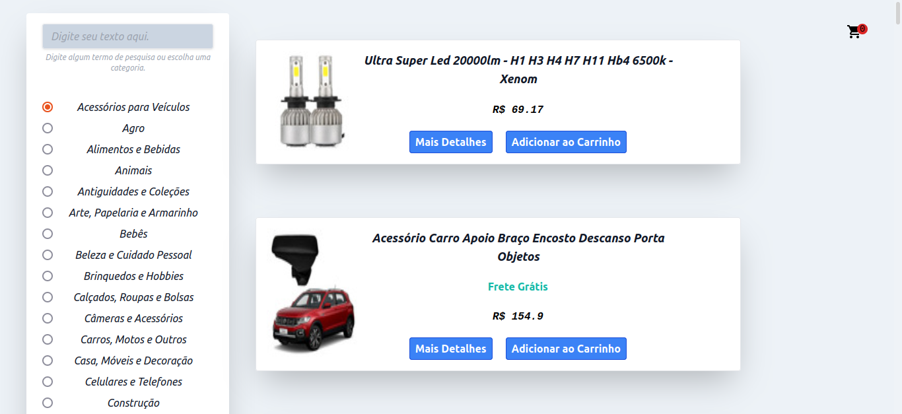
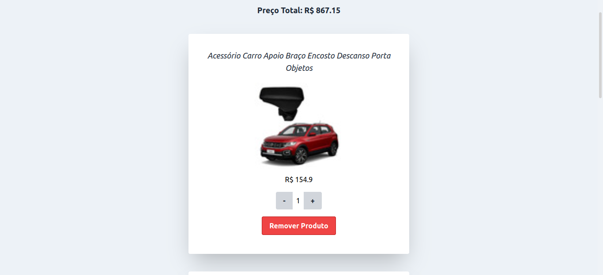
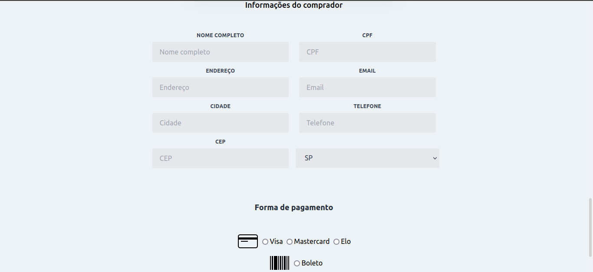

# Projeto Front-end Online Store | Trybe

## Screenshots

## Descrição do Projeto
Neste projeto foi feito uma simulação de uma loja virtual utilizando a API do Mercado Livre para o recebimento de dados

## Tecnologias Utilizadas
- React
- Javascript
- ContextAPI
- CSS/Tailwind

## Links
[Deploy da aplicação](https://project-front-end-online-store1.vercel.app/)
